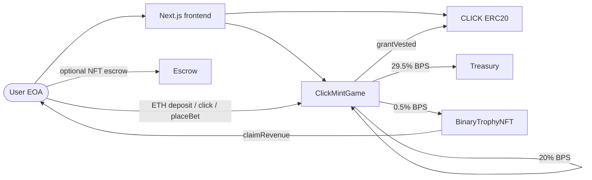

# ClickMint — architecture

High-level map of how deployed pieces fit together. Arrows show value or control flow that matters for the current game UI.

## System diagram

**Deployed but not in the deposit split:** **`SecretPrizeWallet`** is still produced by **`deploy.ts`** for ledger / future use; **`ClickMintGame`** does not send deposit ETH to it today.

**Note:** Trophy minting may be owner/ops-assisted in MVP; **`BinaryTrophyNFT`** + **`Escrow`** are not fully driven by every `click()` in scripts.

## Contract roles

### ClickMintGame

Central game contract. Holds **ETH credits** per user, **minute** `roundId` stats, **POT ETH** + **Block Bet** state, and settlement.

**POT funding:** **`deposit()`** accrues ETH to the pot per **`POT_BPS`** (50%). **`click()`** does not add ETH to the pot. **`currentPotEth()`** returns accrued pot for the **current** minute round plus carry.

**Block Bet:** Users call **`placeBet(slot)`** with ETH; **`slot ∈ 0..45`** (46 windows per minute). On **`finalizeRound`**, a winning slot **`0..45`** is drawn separately from the POT’s four click quadrants **`0..3`**.

| Function / area | Role |
|-----------------|------|
| `deposit()` | User sends ETH; **BPS** split to treasury, pot accrual, block-bet deposit bucket, trophy `receive`; credits increase by **`msg.value` + tier bonus**. |
| `click()` / `clickFor(player)` | Burn **`clickCostCredits`**; hash gate; **`grantVested`** on CLICK. |
| `placeBet(slot)` | Parimutuel stake on window **`slot`** for the current round. |
| `finalizeRound(roundId)` | After round end + **`ROUND_BUFFER`**, settles **POT** (ETH to winner) and **Block Bet** (pro-rata winners; failed pushes → **`blockBetClaimableEth`** + **`claimBlockBetEth()`**). **`owner`** or **`potKeeper`**. |
| `setClickExecutor` | EOA links smart account for **`clickFor`**. |
| `pause` / `unpause` | Owner emergency stop. |

**Important views:** `credits`, `clickCostCredits`, `baseClickReward`, `gameRound`, `currentPotEth`, `blockBetCarry`, `blockBetClaimableEth`, etc.

### CLICK (ERC20 + vesting)

Token cap **`maxSupply`** (**immutable** at deploy — **10B** mainnet preset, **1M** testnet). Game is **`onlyGame`** for **`grantVested`**. **POT pays native ETH from the game**, not **`CLICK.mint`** to winners.

| Function | Role |
|----------|------|
| `grantVested` | Game adds vesting schedule / mints vested slice per internal rules. |
| `claimVested` | User pulls vested CLICK. |
| `earlySpendPending` | 30/30/20/20 style split on **unvested** (see contract). |

### Treasury

Receive + owner sweep; gets **treasury BPS** on each deposit.

### SecretPrizeWallet

Deployed alongside the stack; **not** wired into **`ClickMintGame.deposit`** in the current contract.

### BinaryTrophyNFT

ERC721 + royalties; **`receive()`** for deposit-driven ETH; holders **`claimRevenue`**.

### Escrow

Optional NFT hold/claim flows outside the core click loop.

## Frontend mapping

| UI concern | Contract source |
|------------|-------------------|
| ETH credit balance | `ClickMintGame.credits(user)` |
| Plays left (display) | Derived from credits + `clickCostCredits` + display helpers (`game-display.ts`). |
| Unvested / early spend | `CLICK.pendingVested(user)` |
| Claimable | `CLICK.claimable(user)` |
| Per-click reward | `ClickMintGame.baseClickReward()` |
| POT | `currentPotEth`, `finalizeRound`, **`PotWin`** (ETH) |
| Block Bet | `placeBet`, sidebar pot, **`claimBlockBetEth`** when pull balance &gt; 0 |

## Security / production notes (brief)

- POT + Block Bet randomness: pseudo-random today — plan **VRF** for high-stakes mainnet.
- Owner / **`potKeeper`** centralization: use dedicated keeper + multisig owner for production.
- After deploy: [POST_DEPLOY_VERIFICATION.md](POST_DEPLOY_VERIFICATION.md) / **`verify-deployment.ts`**.
