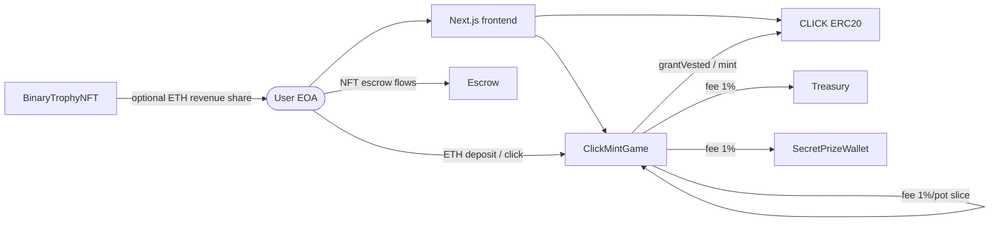

# ClickMint — architecture

High-level map of how deployed pieces fit together. Arrows show value or control flow that matters for the current game UI.

## System diagram

**Note:** `BinaryTrophyNFT` and `Escrow` are deployed alongside the core loop; trophy mint/revenue and escrow are not fully orchestrated by `ClickMintGame` in the MVP scripts.

## Contract roles

### ClickMintGame

Central game contract. Holds **ETH credits** per user (`credits[address]`), hourly click stats, POT ETH per hour, and settlement state.

**POT funding:** Only `deposit()` adds ETH to `potEthByHour[currentHour]` (1% of each deposit). **`click()` does not add ETH** to the pot. `currentPotEth()` returns `potEthByHour[nowGameHour] + potCarry` (carry from prior finalizations). Expect **0 for “this hour”** if no one deposited in the current UTC game hour, even when global clicks > 0.

| Function / area | Role |
|-----------------|------|
| `deposit()` | User sends ETH; 3× 1% fees to treasury, secret wallet, and POT; remainder credited **1:1 as wei** to `credits[msg.sender]`. |
| `click()` | EOA path; same core logic as `clickFor` but for `msg.sender`. |
| `clickFor(player)` | Gasless / smart-account path: caller must be `clickExecutor[player]`; runs `_click(player)` so credits / POT / vesting stay on the EOA. |
| `setClickExecutor(executor)` | EOA links its smart account (or revokes with `address(0)`). |
| `depositFor(player)` | Credits `player` when caller is `player` or `clickExecutor[player]` (optional; UI uses EOA `deposit()`). |
| `finalizeHour(hourId)` | After hour end + buffer, picks a **random 15-minute UTC span** (start minute **0–44**), intersects with each player’s **per-minute click bitmask** (`minuteMask`), then picks winner; **sends accumulated POT as native ETH** to the winner (`call{value}`); may carry ETH forward. Callable by **`owner`** or **`potKeeper`**. See **`docs/LP_AERODROME_AND_AUTOMATION.md`**. |
| `pause` / `unpause` | Owner emergency stop (blocks deposits, clicks, executor linking, finalization; sweep still allowed). Emits **`GamePaused` / `GameUnpaused`** (and OpenZeppelin **`Paused` / `Unpaused`**). |
| `isPaused()` | Alias for **`paused()`** — convenience for integrators. |
| `setTrophyNft` / `mintTrophyForPlayer` | Link trophy contract; owner forwards mint to Binary Trophy; emits **`TrophyMintedViaGame`**. |
| `setEconomy` / `setAddresses` | Owner tuning. |

**Important view getters:** `credits`, `clickCostCredits`, `baseClickReward`, `clicksPerHashTier`, `currentPotEth`, `gameHour`, `totalClicksInHour`, `hourFinalized`, etc.

### CLICK (ERC20 + vesting)

Token cap `maxSupply` (**immutable**, set at deploy — mainnet target **100B**, testnet default **1M**). Game is **`onlyGame`**: **`grantVested`** (vesting vault schedule). **POT pays ETH from the game balance**, not `CLICK.mint`.

| Function | Role |
|----------|------|
| `grantVested(to, amount)` | Game adds to user’s **internal vesting vault** (`_vault`): may mint already-vested slice; resets vesting clock for combined unvested + new amount. |
| `claimVested()` | User mints linearly vested portion to their wallet. |
| `earlySpendPending(amount)` | User burns from **unvested** slice only (`pendingVested` view = unvested cap); applies 30/30/20/20 split (burn/treasury/LP/user mints). Reverts `click: unvested` if `amount` too large. |
| `pendingVested(account)` | **Misleading name:** returns **unvested** wei still subject to linear vesting (and early-spend cap). |
| `claimable(account)` | Vested amount not yet claimed (can call `claimVested`). |
| `mint` | Game-only; available on **CLICK** for legacy/integration paths — **hourly POT does not mint CLICK to winners** (ETH payout from **ClickMintGame**). |

**Why claimable / unvested jump on every click:** `grantVested` uses `_syncAndGrant`: it first **mints** any slice that has already vested under the current schedule, then sets **`v.total = oldUnvested + newReward`** and **`v.start = block.timestamp`**. Vesting **restarts from “now”** each time you earn new rewards, so on-chain numbers move in steps (not a smooth clock independent of clicks).

Transfer tax (if enabled) sends a BPS slice to `treasury`.

### Treasury & SecretPrizeWallet

Simple **receive + owner sweep** contracts. Game sends fee slices on each `deposit`.

### BinaryTrophyNFT

ERC721 + EIP-2981 royalties; **`maxSupply`** is **immutable** at deploy (mainnet **10,000**, testnet **10**). **`receive()`** splits incoming ETH with an **O(1) reward accumulator**; trophy holders call **`claimRevenue(tokenId)`** to pull their share. Not wired into `click()` in the core game contract.

### Escrow

Holds ERC721 in a **hold**; beneficiary (or owner) **`claim`** to release. Optional UX/game integration separate from `ClickMintGame`.

## Frontend mapping

| UI concern | Contract source |
|------------|-----------------|
| ETH credit balance | `ClickMintGame.credits(user)` |
| Plays left (display) | Derived from credits wei + UI constant `DISPLAY_PLAY_ETH` (`frontend/lib/game-display.ts`), not raw `credits / clickCostCredits` when cost is dust. |
| Unvested / early spend cap | `CLICK.pendingVested(user)` |
| Claimable | `CLICK.claimable(user)` |
| Per-click reward | `ClickMintGame.baseClickReward()` |
| POT | `currentPotEth`, `finalizeHour`, `PotWin` (**ETH** to winner, `ethPayout` wei) |

## Security / production notes (brief)

- POT randomness uses block data + nonce — fine for testnet; production should use VRF or similar.
- Owner powers: game economy, treasury/secret addresses, CLICK treasury/LP/game pointer, trophy minting.
- Admin txs should surface in logs via dedicated events (**`GameSet`**, **`GamePaused`/`GameUnpaused`**, **`Swept`**, etc.). After deploy, run **`docs/POST_DEPLOY_VERIFICATION.md`** / **`verify-deployment.ts`**.
- Users must trust contract audits and upgrade policy (immutable game + token in standard deploy).
