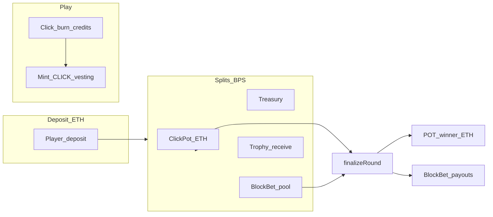

# ClickMint — game mechanics (canonical spec)

This document describes **target product behavior** aligned with the current codebase direction: **minute-long rounds**, **ETH Click Pot**, **Block Bet** with **46** independent ETH pools per minute (15s windows `k..k+14` for `k = 0..45`), **50 / 29.5 / 20 / 0.5** deposit routing (Pot / Treasury / Block Bet / Trophy revshare), **10B CLICK cap**, **1 CLICK per successful click** (1e18 wei), **30-day vesting** on mainnet, and **gasless** optional path via Pimlico.

**Randomness:** Settlement uses on-chain pseudo-randomness (`block.prevrandao` + salts). High-stakes production should plan for **Chainlink VRF** or equivalent.

---

## Time model

| Concept | Definition |
|--------|------------|
| **Round** | One **UTC minute** bucket, indexed by `roundId = (block.timestamp - ROUND_BUFFER) / 60` (see contract `ROUND_BUFFER`, on the order of a few seconds). |
| **15-second slot** | Within a minute, second-in-minute `0–14 → slot 0`, `15–29 → slot 1`, `30–44 → slot 2`, `45–59 → slot 3`. |
| **Settlement** | After the round ends and `ROUND_BUFFER` passes, **`finalizeRound(roundId)`** may run (owner or `potKeeper`). |

---

## Deposits and click credits

- Players deposit **native ETH**. **Click credits** are bookkeeping in **wei-sized units** (same convention as today): you receive **full deposit wei** toward credits plus **tier bonuses** (larger single deposits get extra credits). The ETH itself is **not** held 1:1 as “backing” for credits; credits are burned per click via `clickCostCredits`.
- **Routing of each deposit (basis points, sum 10_000):**
  - **50%** — **Click Pot** (ETH accrues in the game contract for that round’s POT winner).
  - **~29.5%** — **Treasury** (sent to the treasury address).
  - **20%** — **Block Bet** pool for that round (parimutuel layer; see below).
  - **~0.5%** — **Binary Trophy NFT** contract (`receive()`), split **pro-rata** across minted trophies (existing accumulator + `claimRevenue` on the NFT). If the trophy address is not yet wired, that slice is sent to treasury instead.

Exact BPS constants live on-chain (`ClickMintGame`) and may be tuned only by a **new deploy** if made immutable, or via owner-governed setters if added later.

---

## Clicks, hash difficulty, rate limits

- Each successful `click` / `clickFor` burns **`clickCostCredits`** wei of credits and mints **`baseClickReward`** wei of **CLICK** into **vesting** (see [CLICK token](#click-token)).
- **Clickhash:** Global click count per round drives difficulty (required leading zero bits), capped at 4 bits; `clicksPerHashTier` is set from deploy presets (`economy.ts`).
- **On-chain rate limit:** Clicks per **L2 block** are capped (`MAX_CLICKS_PER_BLOCK`). On Base, block times are ~2s; this is **not** the same as “clicks per wall-clock second” but sets an upper bound for bursts. The UI may add a short client-side cooldown for UX.

---

## CLICK token

| Parameter (mainnet-style target) | Value |
|----------------------------------|--------|
| Max supply | **10,000,000,000 × 1e18** (10B CLICK) |
| Reward per successful click | **1 CLICK** = **1e18** wei into vesting |
| Vesting (final launch target) | **30 days** |
| Transfer tax | 1% to protocol (unchanged pattern; see contract) |
| Early claim | 30/30/20/20 style split (see `CLICK.sol`) — longer vesting encourages early claim and burn dynamics |

**Pricing intent (~$0.10 per click):** `clickCostCredits` is set from **ETH/USD** assumptions in `economy.ts` (e.g. `MAINNET_ETH_USD`). “10 credits per $1” in product language maps to **marketing display**; on-chain credits remain **wei-based**.

---

## Click Pot (ETH)

- Funded from the **Pot BPS** slice of every deposit for activity in that round (and rolled **carry** when no winner).
- **Eligibility:** At least **`minPotClicks`** in the round **and** the player must have at least one click in the **winning 15-second slot** (random `winSlot ∈ {0,1,2,3}` at finalize).
- **Winner:** Pseudo-random among eligible participants; entire accrued POT + carry for that settlement path is sent as **native ETH** (not CLICK).

---

## Block Bet (ETH, v1)

- **46 on-chain slots per minute:** Slot **`k`** (where **`k ∈ {0,…,45}`**) is the **15-second window** covering **seconds `k` through `k+14`** of the wall-clock minute (only **`k ≤ 45`** fits fully in a 60s minute — that yields **46** windows). Each slot has its own stake totals: **`placeBet(k)`** adds ETH to pool **`k`** only.
- **Parimutuel pool per round:** **20%** deposit slice for that round **plus** all ETH staked via **`placeBet`** across **all 46** slots.
- **Settlement:** On `finalizeRound`, the **ETH POT** still draws a **winning quadrant `0..3`** (same as click **`slotInRound`** buckets) for click/POT eligibility. **Block bet** draws a **separate** winning index **`0..45`** from mixed entropy (`BLOCKBET46`). Only stakers on **that** window split the Block Bet pot **pro-rata**; other slots’ stakes do not win this round.
- **Failed winner transfer:** If a winner’s address cannot accept ETH during settlement, that share is credited to **`blockBetClaimableEth[winner]`** and the winner calls **`claimBlockBetEth()`** to pull it (so one bad recipient cannot block `finalizeRound` for everyone).
- **No bets on the winning slot:** The pot **carries** forward (`blockBetCarry`) until a future round pays out.
- **Asset:** **ETH only** in v1; USDC or hybrid pools would be a separate upgrade.

---

## Binary Trophy NFT

- Minting: probability `trophyDropWeight / TROPHY_ROLL_DENOM` (1e9 scale) per successful click, tuned so expected supply completes by ~75% of max CLICK minted; owner paths unchanged conceptually.
- **Revenue:** EIP-2981 royalties + **deposit-driven** ETH via `receive()` (see split above). Holders **claim** accrued ETH with `claimRevenue` (pull pattern). Live “accrued” display belongs on the **frontend** (reads `rewardPerShareStored` vs paid per token).

---

## Gasless clicks (Pimlico)

- EOAs link a **click executor** smart account; **`clickFor(player)`** is sponsored per policy. **Pimlico** project must allow the chain ID (e.g. Base / Base Sepolia) and your **game** contract address in the sponsorship policy.

---

## Operational notes

- **Testnet:** Primary environment for full-loop testing (cheap, `tCLICK` / `tBTROPHY` branding).
- **Mainnet:** Use **preview.clickmint.app** (or a dedicated Preview deployment) with **Vercel Preview/Development** env for staged testing; **Uniswap v2–style LP** on mainnet is often validated separately from testnet liquidity tooling.
- **Cron / keeper:** `potKeeper` calls `finalizeRound` on a schedule; fund the keeper with ETH for gas.

---

## Diagram

